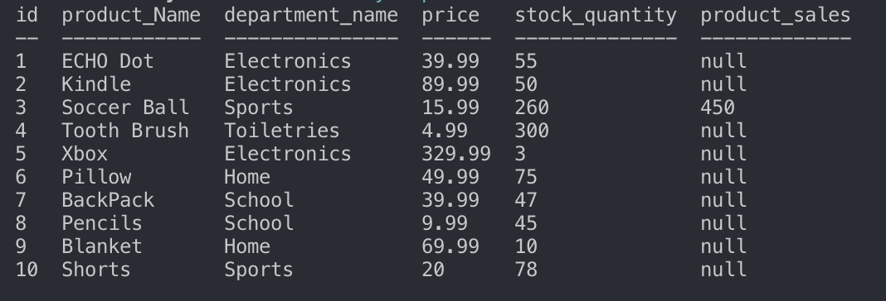

# Bamazon

### Project OverView 

Bamazon is a terminal based amazon-like storefront. A user can act as a customer, or manager while interacting with bamazon. A user can can purchase products, view products, add inventory, add products, create new departments, and more. All of the data that users interact with are saved in a local MySQL database. 

### How Bamazon Works

Bamazon's functionality was created using javascript and it is executed via node. Inquirer and prompts are used to allow users to choose what tasks they want to perform, and it allows users to input information. All initial data, and any changes made to data are done through MYSQL. 

# Customer View

### How Customer View Works 

*   When a user invokes the node application, a user menu is displayed. The user menu is displayed and interacted with via inquirer prompts. The user can choose to view and buy products, or exit the application. If a user wants to buy a product, they enter the ID of the product they want, and the quantity of said item. If the quantity the user wants is more then the stock quantity then a warning will be logged letting the user know that there is not enough stock available. Using MYSQL syntax the quantity and the purchase price is updated in the MYSQL table. 

### Example Photos

* Customer menu displayed after running node bamazonCustomer.js

* Customer Product View 

* Warning letting a user know that they are attempting to order a quantity larger then the quantity available for purchase. 

# Manager View

### How Manager View Works

