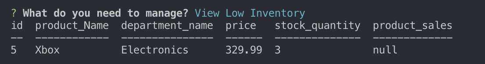

# Bamazon

### Project OverView 

Bamazon is a terminal based amazon-like storefront. A user can act as a customer, or manager while interacting with bamazon. A user can purchase products, view products, add inventory, add products, create new departments, and more. All of the data that users interact with are saved in a local MySQL database. 

### How Bamazon Works

Bamazon's functionality was created using javascript and it is executed via node. Inquirer and prompts are used to allow users to choose what tasks they want to perform and it allows users to input information. All initial data and any changes made to data are done through MYSQL. 

## Customer View

### How Customer View Works 

*   When a user invokes the customer node application, a user menu is displayed. The user menu is displayed and interacted with via inquirer prompts. The user can choose to view and buy products, or exit the application. If a user wants to buy a product, they enter the ID of the product they want, and the quantity of said item. If the quantity the user wants is more then the stock quantity then a warning will be logged letting the user know that there is not enough stock available. Using MYSQL syntax the quantity and the purchase price is updated in the MYSQL table. 

### Example Photos

* Customer menu displayed after running node bamazonCustomer.js

* Customer product view, as well as prompt that asks user the id and quantity of what they want purchased. 

* Warning letting a user know that they are attempting to order a quantity larger then the quantity available for purchase.
 

## Manager View

### How Manager View Works

* When a user invokes the manager node application, a menu for the manger is displayed. The manager can choose to manage low inventory, add inventory, add products, and view products by interacting with inquirer prompts in the command line. If the manager chooses to view products for sale, the manager will be viewing all of the product related data stored in it's associated SQL database. If the manager chooses to view low inventory, then all of the products have a stock quantity less than 5 will be displayed. If there are no products with a quantity less than 5, then a message will be displayed letting the manager know so. If a manager wants to add inventory, then they will be prompted to pick a product ID, and the quantity of stock they want to add for said product. If a manager wants to add a new product, they will be prompted to input the product name, department name, product price, and stock quantity. All database changes are updated in the local MySQL database via connection queries. 

### Example Photos

* Manager menu displayed after running node bamazonCustomer.js

* Low inventory display for any products with a inventory of 5 or less.

* Low inventory display when there are no products with a inventory of 5 or less.

* Add inventory display, after inventory has been added through prompts.

* Add product display, after a product has been added through prompts. 

